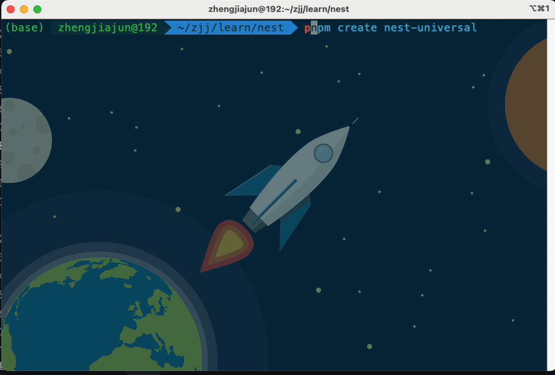

# create-nest-universal <a href="https://npmjs.com/package/create-vue"></a> <a href="https://nodejs.org/en/about/previous-releases"></a>

The recommended way to start a universal nestjs template

<p align="center">
  
</p>

## 使用

使用 `create-nest-universal`创建nest通用模版
```sh
pnpm create nest-universal@latest
```

## 通用模块
- ✅ 多环境配置
- ✅ 全局异常捕获
- ✅ 日志模块
- ✅ 响应格式标准化
- ✅ 参数校验
- ✅ 数据库
- ✅ 数据库迁移
- ✅ 基于角色的鉴权
- ✅ Redis缓存
- ✅ 接口文档
- ✅ 邮件服务
- ✅ docker部署


